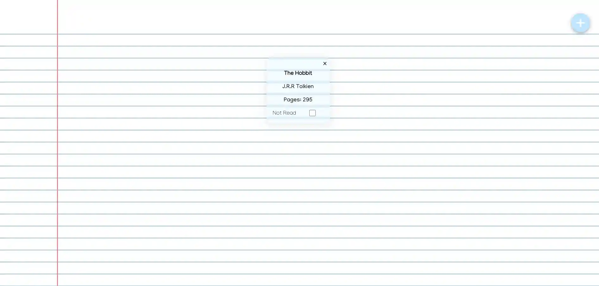

<h1 style="text-align: center;">Library Project</h1>

  
  
  
 

>  This is an easy way to store read books in a library
>  
>  Project is from [The Odin Project](https://www.theodinproject.com/lessons/node-path-javascript-library)
>  

Originally created 6/4/22

## 📝 Lessons Learned

While refactoring from my beginner days, I have removed images stored in the repo. 
Which made it 1.4mb. It is now 30kb. The cool paper effect CSS gradient is from [Gradient Magic](https://www.gradientmagic.com/collection/paper/gradient/1619226563318)